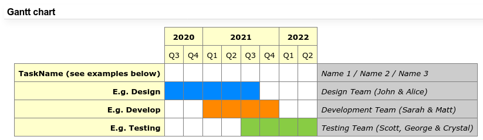
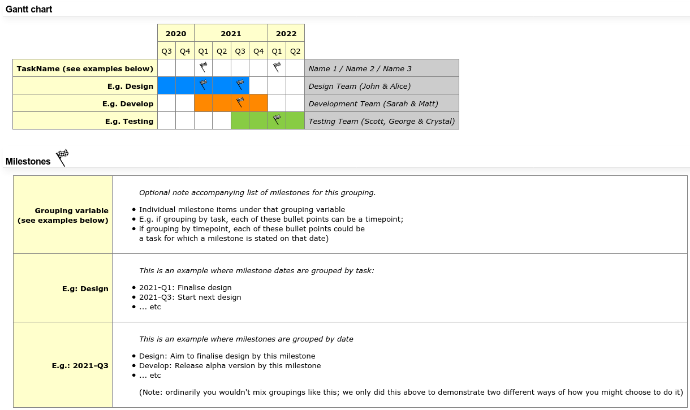

# `trac`-compatible Gantt-chart template

A template to create simple gantt charts in trac using the trac-compatible subset of plain html.

Example of a simple gantt chart, without explicit milestone markers:

Example of a gantt chart, with added milestone markers:

----

These templates are designed specifically for editing by hand, and then copy pasting directly onto a trac editor (wiki or tickets).  

Note that, while the html code looks very straightforward, trac itself is very unforgiving about the subset of html it 
supports, and finding the exact subset and format that produces the expected results was not a trivial matter; hence 
this template, in the hope that it saves someone else from wasting time trying to produce trac-compatible html.

Specifically, note that css is hardcoded inside the html tags for a reason, since trac tends to break down if proper css 
style headers are attempted.

----

This repository contains two templates: a simple template without milestones, and one with milestone markers.

Both template files define an 'empty' template section, and a couple of 'prefilled' examples.

A future iteration might also provide an automated script which dumps out the code for direct copy/pasting, but
in any case, it should be straightforward and painless enough to do this by hand anyway.

E.g. filling in the appropriate progress bar should be a simple case of performing a find-and-replace operation on 
"`______`" in your favourite text-editor, and replacing with an appropriate 6-digit hexadecimal colour code as 
appropriate. Copying the resulting html script directly into a trac wiki-editor should then display a nice table with progress bars 
handled by css.

Regarding the 2nd template which uses a milestone marker, this is labelled as milestone.png in the code, however this should be replaced with a valid url to an image of your choice throughout.
A milestone.png image is provided for convenience; you can add this as an attachment to the wiki page you intend to put the gantt chart to, and then replace all instances of milestone.png with the actual url of that attachment.

----

Note: I have kept the extension of the template files as .html, purely to enable syntax highlighting in the code.
However, if you happen to open this file normally in a browser by itself, you will note the presence of ugly `{{{#!html` and `}}}` 
trac preprocessor directives surrounding the html code. Do not remove these, they are intentional; when the code is 
copy-pasted in a trac wiki-editor, these preprocessor directives instruct trac to interpret the enclosed code as html, 
as opposed to trac-wiki syntax. Unlike when opening the file by itself, these brackets will not be visible in the resulting trac wiki page.
